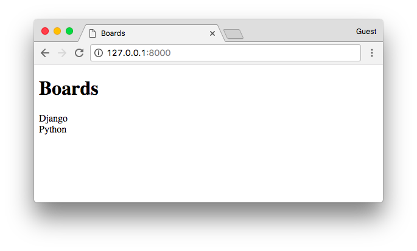
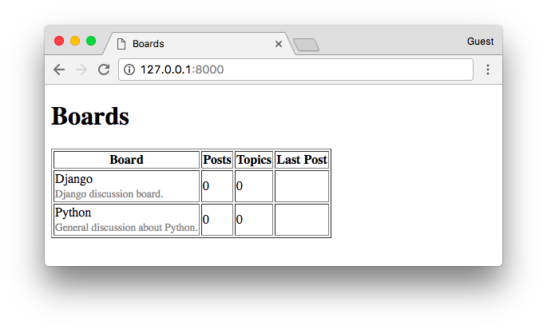

创建模板，使用标签。
<!--more-->
在manage.py所在的目录创建一个名为 **templates**的新文件夹：

```sh
myproject/
 |-- myproject/
 |    |-- boards/
 |    |-- myproject/
 |    |-- templates/   <-- 这里
 |    +-- manage.py
 +-- venv/
```

在templates文件夹中，创建一个名为home.html的HTML文件：


**templates/home.html**

```html
<!DOCTYPE html>
<html>
  <head>
    <meta charset="utf-8">
    <title>Boards</title>
  </head>
  <body>
    <h1>Boards</h1>

    
      {{ board.name }} <br>
    

  </body>
</html>
```


在上面的例子中，我们混入了原始HTML和一些特殊标签 ```` 和 `{{ variable }}` 。它们是Django模板语言的一部分。上面的例子展示了如何使用 ``for``遍历列表对象。`{{ board.name }}`会在 HTML 模板中会被渲染成版块的名称，最后生成动态HTML文档。

在我们可以使用这个HTML页面之前，我们必须告诉Django在哪里可以找到我们应用程序的模板。

打开**myproject**目录下面的**settings.py**文件，搜索`TEMPLATES`变量，并设置`DIRS` 的值为 `os.path.join(BASE_DIR, 'templates')`：


```python
TEMPLATES = [
    {
        'BACKEND': 'django.template.backends.django.DjangoTemplates',
        'DIRS': [
            os.path.join(BASE_DIR, 'templates')
        ],
        'APP_DIRS': True,
        'OPTIONS': {
            'context_processors': [
                'django.template.context_processors.debug',
                'django.template.context_processors.request',
                'django.contrib.auth.context_processors.auth',
                'django.contrib.messages.context_processors.messages',
            ],
        },
    },
]
```

本质上，刚添加的这一行所做的事情就是找到项目的完整路径并在后面附加“/templates”

我们可以使用Python shell进行调试：

```sh
python manage.py shell

```

```python
from django.conf import settings

settings.BASE_DIR
'/Users/vitorfs/Development/myproject'

import os

os.path.join(settings.BASE_DIR, 'templates')
'/Users/vitorfs/Development/myproject/templates'
```
看到了吗？它只是指向我们在前面步骤中创建的**templates**文件夹。

现在我们可以更新**home**视图：

**boards/views.py**

```python
from django.shortcuts import render
from .models import Board

def home(request):
    boards = Board.objects.all()
    return render(request, 'home.html', {'boards': boards})
```

生成的HTML：



我们可以用一个更漂亮的表格来替换，改进HTML模板：

**templates/home.html**



