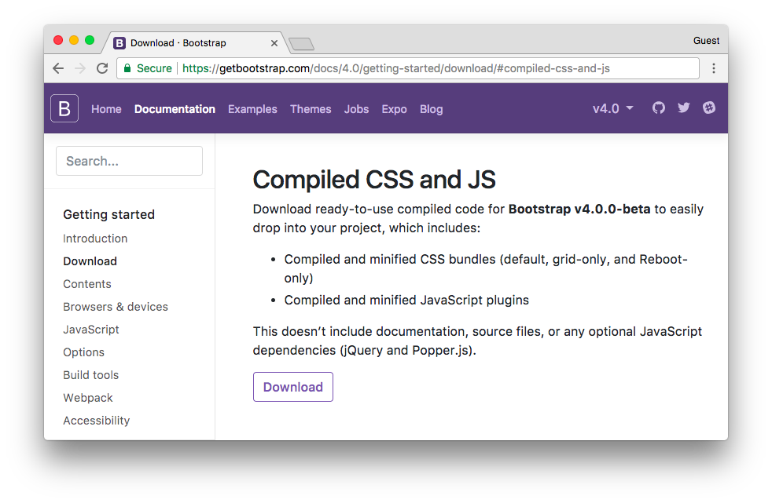

Django入门指南-第9章：静态文件设置
<!--more-->


静态文件是指 CSS，JavaScript，字体，图片或者是用来组成用户界面的任何其他资源。

实际上，Django 本身是不负责处理这些文件的，但是为了让我们的开发过程更轻松，Django 提供了一些功能来帮助我们管理静态文件。这些功能可在 `INSTALLED_APPS` 的 **django.contrib.staticfiles** 应用程序中找到（译者：Django为了使得开发方便，也可以处理静态文件，而在生产环境下，静态文件一般直接由 Nginx 等反向代理服务器处理，而应用工服务器专心负责处理它擅长的业务逻辑）。

市面上很多优秀前端组件框架，我们没有理由继续用简陋的HTML文档来渲染】。我们可以轻松地将Bootstrap 4添加到我们的项目中。Bootstrap是一个用HTML，CSS和JavaScript开发的前端开源工具包。

在项目根目录中，除了 boards, templates 和myproject文件夹外，再创建一个名为static的新文件夹，并在static文件夹内创建另一个名为css的文件夹：

```shell
myproject/
 |-- myproject/
 |    |-- boards/
 |    |-- myproject/
 |    |-- templates/
 |    |-- static/       <-- here
 |    |    +-- css/     <-- and here
 |    +-- manage.py
 +-- venv/
 ```

 转到[getbootstrap.com](https://getbootstrap.com/docs/4.0/getting-started/download/#compiled-css-and-js)并下载最新版本：





下载编译版本的CSS和JS

在你的计算机中，解压 bootstrap-4.0.0-beta-dist.zip 文件，将文件 css/bootstrap.min.css 复制到我们项目的css文件夹中：

```python
myproject/
 |-- myproject/
 |    |-- boards/
 |    |-- myproject/
 |    |-- templates/
 |    |-- static/
 |    |    +-- css/
 |    |         +-- bootstrap.min.css    <-- here
 |    +-- manage.py
 +-- venv/
 ```

 下一步是告诉Django在哪里可以找到静态文件。打开settings.py，拉到文件的底部，在**STATIC_URL**后面添加以下内容：

 ```python
 STATIC_URL = '/static/'

STATICFILES_DIRS = [
    os.path.join(BASE_DIR, 'static'),
]
```

还记得 **TEMPLATES**目录吗，和这个配置是一样的

现在我们必须在模板中加载静态文件（Bootstrap CSS文件）：


**templates/home.html**

```html

<!DOCTYPE html>
<html>
  <head>
    <meta charset="utf-8">
    <title>Boards</title>
    <link rel="stylesheet" href="">
  </head>
  <body>
   <h1>Boards</h1>

<table border="1">
    <thead>
    <tr>
        <th>Board</th>
        <th>Posts</th>
        <th>Topics</th>
        <th>Last Post</th>
    </tr>
    </thead>
    <tbody>
    
        <tr>
            <td>
                {{ board.name }}<br>
                <small style="color: #888">{{ board.description }}</small>
            </td>
            <td>0</td>
            <td>0</td>
            <td></td>
        </tr>
    
    </tbody>
</table>
</body>
</html>
```


首先，我们在模板的开头使用了 Static Files App 模板标签 ````。


模板标签``用于构成资源文件完整URL。在这种情况下，``将返回 **/static/css/bootstrap.min.css**，它相当于 http://127.0.0.1:8000/static/css/bootstrap.min.css。

``模板标签使用 settings.py文件中的 `STATIC_URL` 配置来组成最终的URL，例如，如果您将静态文件托管在像 https://static.example.com/ 这样的子域中 ，那么我们将设置 `STATIC_URL=https://static.example.com/` ，然后 ``返回的是 **https://static.example.com/css/bootstrap.min.css**

如果目前这些对你来说搞不懂也不要担心。只要记得但凡是需要引用CSS，JavaScript或图片文件的地方就使用``。稍后，当我们开始部署项目到正式环境时，我们将讨论更多。现在都设置好了。

刷新页面 http://127.0.0.1:8000 ，我们可以看到它可以正常运行：


现在我们可以编辑模板，以利用Bootstrap CSS：

```html
<!DOCTYPE html>
<html>
  <head>
    <meta charset="utf-8">
    <title>Boards</title>
    <link rel="stylesheet" href="">
  </head>
  <body>
    <div class="container">
      <ol class="breadcrumb my-4">
        <li class="breadcrumb-item active">Boards</li>
      </ol>
      <table class="table">
        <thead class="thead-inverse">
          <tr>
            <th>Board</th>
            <th>Posts</th>
            <th>Topics</th>
            <th>Last Post</th>
          </tr>
        </thead>
        <tbody>
          
            <tr>
              <td>
                {{ board.name }}
                <small class="text-muted d-block">{{ board.description }}</small>
              </td>
              <td class="align-middle">0</td>
              <td class="align-middle">0</td>
              <td></td>
            </tr>
          
        </tbody>
      </table>
    </div>
  </body>
</html>
```


显示效果：


到目前为止，我们使用交互式控制台（python manage.py shell）添加了几个新的版块。但我们需要一个更好的方式来实现。在下一节中，我们将为网站管理员实现一个管理界面来管理这些数据。

 
